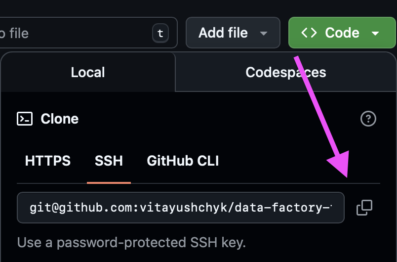
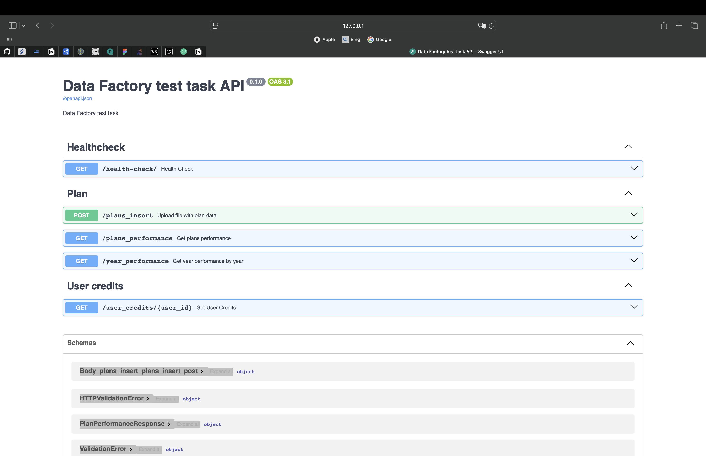

# **Data Factory test task**

## Installation:

### Clone this repository using GitHub Desktop:

## Preparations:

### .env:

Please, make sure that you have a .env in the root folder. Feel free to specify values of environmental variables as you
wish, but make sure that your .env file structured like .env.example.

## Run app with Docker:

Firstly, you need to have [Docker](https://docs.docker.com/get-docker/) installed in your system.

- Run application:

      make run_app

## Apply migrations with Alembic

- Create migration. Usage `make create_migrations m="migration message"`:

      make create_migrations

- Apply migrations:

      make migrate

## Interactive API docs:

      http://host:port/docs

After you will see the automatic interactive API documentation (provided by Swagger UI):

## Contributors:

- [Vita Yushchyk](https://www.linkedin.com/in/vita-yushchyk-484680205/)